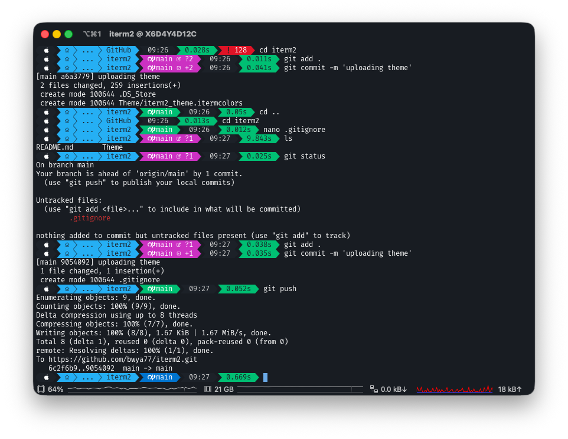

# iTerm2 Theme

A custom color theme for iTerm2.

## Installation

1. Download the `Theme/iterm2_theme.itermcolors` file
2. Open iTerm2
3. Go to **Preferences** > **Profiles** > **Colors**
4. Click **Color Presets...** dropdown
5. Select **Import...**
6. Choose the downloaded `.itermcolors` file
7. Select the theme from the **Color Presets...** dropdown
